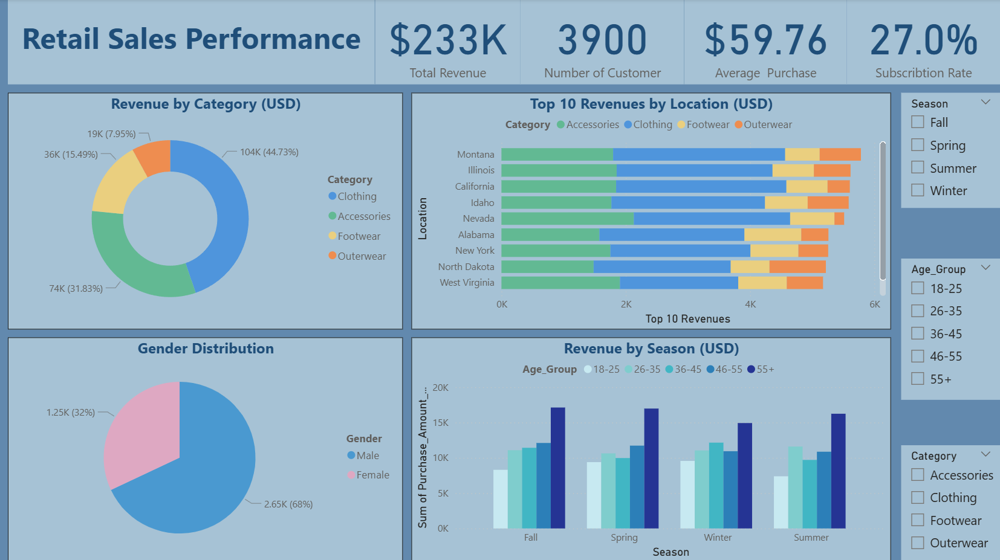
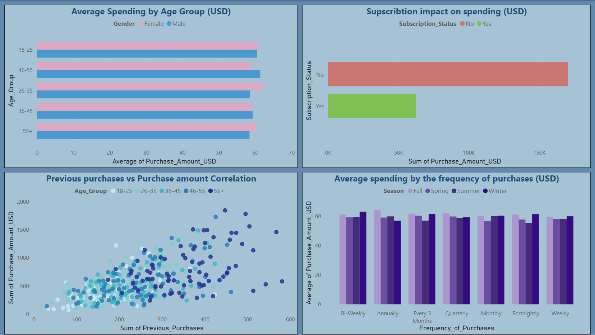

# Retail Sales Performance Dashboard

## Overview

This project presents an end-to-end **retail sales data analysis and visualization pipeline** using Python, SQL Server, and multiple visualization libraries. The goal is to extract actionable business insights from customer purchase behavior and present them through an interactive and executive-ready dashboard.

The analysis focuses on revenue performance, customer demographics, purchasing frequency, subscription impact, and seasonal trends.

---

## Dataset Description

* **Source**: SQL Server database (`dbo.shopping_trends`)
* **Records**: 3,900 transactions
* **Features**: 19 columns (customer demographics, purchase behavior, and transaction attributes)

### Key Attributes

| Category         | Columns                                                    |
| ---------------- | ---------------------------------------------------------- |
| Customer Info    | Age, Gender, Location                                      |
| Purchase Details | Item_Purchased, Category, Purchase_Amount_USD, Size, Color |
| Behavioral Data  | Previous_Purchases, Frequency_of_Purchases                 |
| Engagement       | Subscription_Status, Review_Rating                         |
| Transaction Info | Payment_Method, Preferred_Payment_Method, Shipping_Type    |
| Promotions       | Discount_Applied, Promo_Code_Used                          |
| Seasonality      | Season                                                     |

The dataset is **fully clean** with no missing values.

---

## Objectives

* Analyze revenue distribution across product categories and locations
* Understand customer demographics and spending behavior
* Measure the impact of subscriptions on revenue
* Identify seasonal and frequency-based purchasing patterns
* Create a visually intuitive dashboard for business stakeholders

---

## Tech Stack

* **Programming Language**: Python
* **Database**: Microsoft SQL Server
* **Data Processing**: Pandas, NumPy
* **Database Connectivity**: PyODBC
* **Visualization**:

  * Matplotlib
  * Seaborn
  * Plotly Express
* **IDE / Environment**: Jupyter Notebook / VS Code

---

## Data Pipeline

1. **Database Connection** using ODBC Driver 17
2. **Data Extraction** from SQL Server into Pandas DataFrame
3. **Data Validation** (schema check, null check, data types)
4. **Exploratory Data Analysis (EDA)**
5. **Visualization & Dashboard Creation**
6. **Export** cleaned dataset to Excel for further use

---

## Key Insights

### Revenue Performance

* **Total Revenue**: $233K
* **Top Category**: Clothing (~45% of total revenue)
* **Strongest Locations**: Montana, Illinois, California

### Customer Demographics

* **Gender Distribution**:

  * Male: 68%
  * Female: 32%
* **Highest Average Spending**: Customers aged **55+**

### Subscription Impact

* Subscribed customers contribute **significantly higher total spending** compared to non-subscribers
* Subscription rate stands at **27%**, indicating growth potential

### Behavioral Trends

* Strong positive correlation between **previous purchases** and **purchase amount**
* Customers purchasing **weekly or bi-weekly** show higher average spending

### Seasonal Patterns

* Spring and Winter generate the highest revenue
* Seasonal preferences vary by age group

---

## Dashboard Components

The dashboard includes:

* KPI summary (Revenue, Customers, Average Purchase, Subscription Rate)
* Revenue by Category (Donut Chart)
* Top 10 Revenue Locations (Stacked Bar Chart)
* Gender Distribution (Pie Chart)
* Revenue by Season and Age Group
* Average Spending by Age & Gender
* Subscription Impact on Spending
* Purchase Frequency vs Average Spending
* Previous Purchases vs Purchase Amount Correlation

*(Dashboard screenshots included in the repository)*

---

## Dashboard Preview

### Executive Overview


### Customer Behavior & Spending Analysis


---

## Installation & Setup

### Prerequisites

* Python 3.8+
* SQL Server
* ODBC Driver 17 for SQL Server

### Install Dependencies

```bash
pip install pandas numpy pyodbc matplotlib seaborn plotly
```

### Database Configuration

Update the connection string in the script:

```python
conn_str = (
    'DRIVER={ODBC Driver 17 for SQL Server};'
    'SERVER=YOUR_SERVER_NAME;'
    'DATABASE=Instant Training;'
    'Trusted_Connection=yes;'
)
```

---

## How to Run

1. Clone the repository
2. Ensure SQL Server is running and accessible
3. Update database credentials
4. Run the Python script or notebook
5. Explore generated visualizations
6. Access the exported Excel file: `customer_purchase_data.xlsx`

---

## Future Enhancements

* Build a fully interactive **Power BI / Streamlit dashboard**
* Apply **customer segmentation (K-Means / RFM)**
* Predict customer lifetime value (CLV)
* Add churn prediction for subscription users

---

## Author

**Steven Akram**
Data Analytics / Data Science Enthusiast

---

## License

This project is for educational and portfolio purposes.
